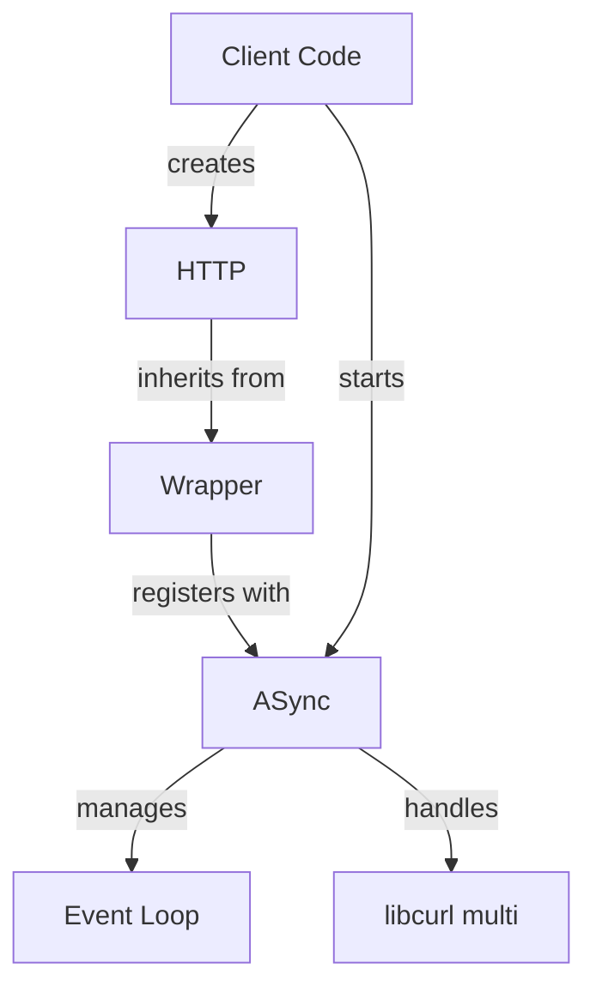

curlev - architecture
=====================

This library is based on the `libcurl` example [multi-uv](https://curl.se/libcurl/c/multi-uv.html]).



The diagram above shows how:
- Client code starts the ASync singleton and creates HTTP instances
- HTTP specializes the Wrapper template
- Wrapper instances register with ASync for request processing
- ASync manages both the event loop and libcurl interactions

# ASync class

The `ASync` class is a singleton that manages the event loop integration
between `libcurl` and `libuv`:

- Wraps a `libuv` event loop that processes all asynchronous operations
- Manages the `libcurl` multi interface for handling multiple concurrent requests
- Provides `start()` and `stop()` methods to control the event loop lifecycle
- Handles timer events for `libcurl` timeouts
- Handle the low level creation and destruction of curl easy handle
- Thread-safe design allows requests from multiple threads

## Threads and locking

There is one thread running in ASync, in `uv_init()` and invoking `uv_run()`.
This thread is the root of all function calls on the ASync side.
Then there are users' threads invoking `start_request()` and `abort_request()`:

The mutex `m_uv_run_mutex` protects the internal objects.

```
    start_request
L       m_nb_running_requests++
L       curl_multi_add_handle  -------------------> multi_cb_timer
L       ! notify_wrapper                 /              uv_timer_stop
L       !     m_nb_running_requests--   /               uv_timer_start  -->>>
                                       / 
L   uv_run                            /      
L       uv_io_cb                     /
L           curl_multi_socket_action  ------------> multi_cb_socket
L                                                       curl_multi_assign
L                                                       uv_poll_start
L           multi_fetch_messages              
L               curl_multi_info_read          
L                   curl_multi_remove_handle
L                   notify_wrapper
L                       m_nb_running_requests--
L                                           
L
L  >>>  uv_timeout_cb
L           multi_fetch_messages
L               curl_multi_info_read
L                   curl_multi_remove_handle
L                   notify_wrapper
L                       m_nb_running_requests--

    abort_request
L       curl_multi_remove_handle
L       notify_wrapper
L           m_nb_running_requests--
```

# Wrapper template

The `Wrapper` template provides the handling of common behavior
of the various protocols offered by `libcurl`.

- Created via static `create()` factory method returning a `shared_ptr`
- Uses the Builder pattern for configuring `libcurl` common features
- Supports both synchronous (`exec()`) and asynchronous (`start()`) operations
- Create extra `shared_ptr` when needed to ensure proper lifecycle management

The classes work together where:
1. `ASync` provides the event loop infrastructure
2. `Wrapper` instances are created and configured by the client
3. When starting a request, the Wrapper's curl easy handle is registered with ASync
4. ASync processes the request asynchronously
5. Results are made available via the `Wrapper`'s `cb_back()`

# HTTP class

This specialization of `Wrapper` implements the HTTP protocol.
The `Wrapper` invokes HTTP just before starting a request to
finish configuring the curl easy handle, and just after
to retrieve protocol specific details.

# References

 - [libcurl](https://curl.se/libcurl/)
 - [libuv](https://libuv.org/)
 - libcurl example [multi-uv](https://curl.se/libcurl/c/multi-uv.html])
 - [GoogleTest](https://google.github.io/googletest/)
