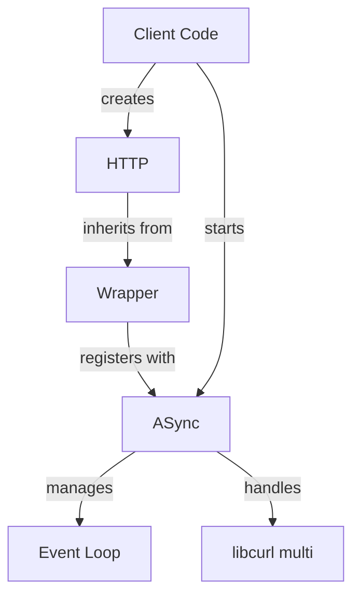

curlev - internals
==================

This library was inspired on the `libcurl` example [multi-uv](https://curl.se/libcurl/c/multi-uv.html).



The diagram above shows how:
- Client code starts the ASync singleton and creates HTTP instances
- HTTP specializes the Wrapper template
- Wrapper instances register with ASync for request processing
- ASync manages both the event loop and libcurl interactions

# ASync class

The `ASync` class managess the event loop integration
between `libcurl` and `libuv`:

- Wraps a `libuv` event loop that processes all asynchronous operations
- Manages the `libcurl` multi interface for handling multiple concurrent requests
- Provides `start()` and `stop()` methods to control the event loop lifecycle
- Handles timer events for `libcurl` timeouts
- Handle the low level creation and destruction of curl easy handle
- Thread-safe design allows requests from multiple threads

## Threads and locking

There are two threads running in ASync:
 1. one in `uv_init()` and invoking `uv_run()`. This thread is the root
    of all function calls on the ASync side.
 2. one in `cb_init()` used to notifying the Wrapper when an operation
    completes (jobs queued from the 1st thread by `post_to_wrapper()`).

Then there are users' threads invoking `start_request()` and `abort_request()`:

The mutex `m_uv_run_mutex` protects the internal objects, the mutex `m_cb_mutex` protects the job queue.

```
    start_request
L       m_nb_running_requests++
L       curl_multi_add_handle  -------------------> multi_cb_timer
L       ! invoke_wrapper                 /              uv_timer_stop
L       !     m_nb_running_requests--   /               uv_timer_start  -->>>
                                       /
L   uv_run                            /
L       uv_io_cb                     /
L           curl_multi_socket_action  ------------> multi_cb_socket
L                                                       curl_multi_assign
L                                                       uv_poll_start
L           multi_fetch_messages
L               curl_multi_info_read
L                   curl_multi_remove_handle
L                   invoke_wrapper
L                       m_nb_running_requests--
L
L  >>>  uv_timeout_cb
L           multi_fetch_messages
L               curl_multi_info_read
L                   curl_multi_remove_handle
L                   invoke_wrapper
L                       m_nb_running_requests--

    abort_request
L       curl_multi_remove_handle
L       invoke_wrapper
L           m_nb_running_requests--
```

# Wrapper template

The `Wrapper` template provides the handling of common behavior
of the various protocols offered by `libcurl`.

- Created via static `create()` factory method returning a `shared_ptr`
- Uses the Builder pattern for configuring `libcurl` common features
- Supports both synchronous (`exec()`) and asynchronous (`start()`) operations
- Create extra `shared_ptr` when needed to ensure proper lifecycle management
- Inherit from `WrapperBase`, which is the class known by `ASync`

The classes work together where:
1. `ASync` provides the event loop infrastructure
2. `Wrapper` instances are created and configured by the client
3. When starting a request:
   1. an extra `shared_ptr` is created and stored in the curl easy handle
   2. the Wrapper's curl easy handle is registered with ASync
4. ASync processes the request asynchronously and:
   1. makes result available via the `Wrapper`'s `cb_back()`
   2. delete the extra `shared_ptr`

## WrapperBase class

The `WrapperBase` class acts as the interface between `ASync` and
protocol-specific wrappers:

- Stores data received from `ASync` during request processing
- Exposes methods that are called by `ASync` to notify about request completion and status updates
- Serves as the base class for all protocol wrappers, enabling polymorphic handling by `ASync`
- Ensures a consistent interface for asynchronous operations across different protocols

# HTTP class

This specialization of `Wrapper` implements the HTTP protocol.
The `Wrapper` invokes HTTP just before starting a request to
finish configuring the curl easy handle, and just after
to retrieve protocol specific details.

# Comparisons with other libraries

[Async++ CURL](https://github.com/asyncpp/asyncpp-curl) is not really
asynchronous, is coroutine based, and has a limited documentation.
Its multi interface doesn't allow to add handle while it run (marked TODO).

[cpr](https://github.com/libcpr/cpr) is succinct but uses std::async and a pool
of threads for callbacks, which can lead to a large number of threads
(number of cores by default).
The multi interface can only be used to run a batch of queries, it is not
possible to add session while Perform is running, and the results are returned
once all requests are terminated.

[curl-multi-asio](https://github.com/MrElectrify/curl-multi-asio) doesn't
really support asynchronous operations, as it "don'ts like adding an
easy handle while it's already processing".

[curlcpp](https://github.com/JosephP91/curlcpp) is exhaustive but low-level
and verbose: a simple request requires numerous lines of call. There is
no real asynchronous model and using the multi interface is not thread
safe, not allowing to add easy handle while another thread loops on perform
(beside the fact that you have to manage that thread and do the polling).

[liblifthttp](https://github.com/jbaldwin/liblifthttp) has a nice API
with both synchronous and asynchronous, detached asynchronous...
but is slow and requests were failing when too numerous.

[restclient-cpp](https://github.com/mrtazz/restclient-cpp) doesn't have
asynchronous functions.

## Performances

The following table shows the timing of an application starting
50K asynchronous calls, each with a callback checking the result
code and incrementing two atomic counters (on a 4c8t CPU):

Config                 | Starting | Waiting  |    Total | CPU usage | RSS
-----------------------|---------:|---------:|---------:|----------:|----------:
asyncpp-curl           |  6.536 s |  0.061 s |  6.597 s |      122% | 363'860 KB
cpr                    |  0.079 s |  2.957 s |  3.036 s |      405% |  29'577 KB
cpr [1 thread]         |  0.029 s | 12.993 s | 13.021 s |       75% |  27'352 KB
curlev                 |  3.488 s |  0.002 s |  3.490 s |       97% |  15'512 KB
curlev [unthreaded CB] |  3.186 s |  0.001 s |  3.187 s |       90% |  15'177 KB

`curlev` was doing around 75 simultaneous requests, and `cpr` 80.

For reference,
the multi models of `curlcpp`, `curl-multi-asio` and `cpr` were tested,
and also the attempt with `liblifthttp`,
but despite increasing the OS limits, it was not possible to go higher
than 30K asynchronous calls:

Config               | Starting |  Waiting  |     Total | CPU usage | RSS
---------------------|---------:|----------:|----------:|----------:|----------:
cpr multi            |  0.170 s | 163.301 s | 163.471 s |      100% | 550'320 KB
curl-multi-asio      |  0.116 s |  99.986 s | 100.102 s |       99% | 538'164 KB
curlcpp              |  0.381 s |  44.966 s |  45.347 s |       99% | 625'204 KB
liblifthttp          |  0.024 s | 104.005 s | 104.029 s |       99% | 528'128 KB

The slowest part in `curlev` was the `start()` function because `ASync::start_request()`
needs to wait `m_uv_run_mutex` which is only unlocked for a short period of time
by `uv_run()`. This bottleneck was removed by increasing the delay depending on
the number of pending requests.

# References

 - [libcurl](https://curl.se/libcurl/)
 - [libuv](https://libuv.org/)
 - libcurl example [multi-uv](https://curl.se/libcurl/c/multi-uv.html)
 - [GoogleTest](https://google.github.io/googletest/)
