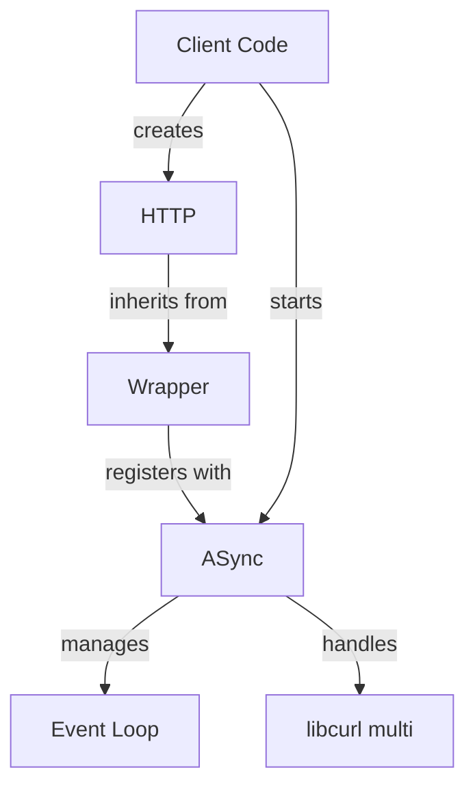

curlev - internals
==================

This library is based on the `libcurl` example [multi-uv](https://curl.se/libcurl/c/multi-uv.html]).



The diagram above shows how:
- Client code starts the ASync singleton and creates HTTP instances
- HTTP specializes the Wrapper template
- Wrapper instances register with ASync for request processing
- ASync manages both the event loop and libcurl interactions

# ASync class

The `ASync` class managess the event loop integration
between `libcurl` and `libuv`:

- Wraps a `libuv` event loop that processes all asynchronous operations
- Manages the `libcurl` multi interface for handling multiple concurrent requests
- Provides `start()` and `stop()` methods to control the event loop lifecycle
- Handles timer events for `libcurl` timeouts
- Handle the low level creation and destruction of curl easy handle
- Thread-safe design allows requests from multiple threads

## Threads and locking

There are two threads running in ASync:
 1. one in `uv_init()` and invoking `uv_run()`. This thread is the root
    of all function calls on the ASync side.
 2. one in `cb_init()` used to notifying the Wrapper when an operation
    completes (jobs queued from the 1st thread by `notify_wrapper()`).

Then there are users' threads invoking `start_request()` and `abort_request()`:

The mutex `m_uv_run_mutex` protects the internal objects, the mutex `m_cb_mutex` protects the job queue.

```
    start_request
L       m_nb_running_requests++
L       curl_multi_add_handle  -------------------> multi_cb_timer
L       ! notify_wrapper                 /              uv_timer_stop
L       !     m_nb_running_requests--   /               uv_timer_start  -->>>
                                       / 
L   uv_run                            /      
L       uv_io_cb                     /
L           curl_multi_socket_action  ------------> multi_cb_socket
L                                                       curl_multi_assign
L                                                       uv_poll_start
L           multi_fetch_messages              
L               curl_multi_info_read          
L                   curl_multi_remove_handle
L                   notify_wrapper
L                       m_nb_running_requests--
L
L  >>>  uv_timeout_cb
L           multi_fetch_messages
L               curl_multi_info_read
L                   curl_multi_remove_handle
L                   notify_wrapper
L                       m_nb_running_requests--

    abort_request
L       curl_multi_remove_handle
L       notify_wrapper
L           m_nb_running_requests--
```

# Wrapper template

The `Wrapper` template provides the handling of common behavior
of the various protocols offered by `libcurl`.

- Created via static `create()` factory method returning a `shared_ptr`
- Uses the Builder pattern for configuring `libcurl` common features
- Supports both synchronous (`exec()`) and asynchronous (`start()`) operations
- Create extra `shared_ptr` when needed to ensure proper lifecycle management

The classes work together where:
1. `ASync` provides the event loop infrastructure
2. `Wrapper` instances are created and configured by the client
3. When starting a request:
   1. an extra `shared_ptr` is created and stored in the curl easy handle
   2. the Wrapper's curl easy handle is registered with ASync
4. ASync processes the request asynchronously and:
   1. makes result available via the `Wrapper`'s `cb_back()`
   2. delete the extra `shared_ptr`

# HTTP class

This specialization of `Wrapper` implements the HTTP protocol.
The `Wrapper` invokes HTTP just before starting a request to
finish configuring the curl easy handle, and just after
to retrieve protocol specific details.

# Comparisons with other libraries

[cpr](https://github.com/libcpr/cpr) is succinct but uses std::async and a pool
of threads for callbacks, which can lead to a large number of threads
(number of cores by default).
The multi interface can only be used to run a batch of queries, it is not
possible to add session while Perform is running, and the results are returned
once all requests are terminated.

[curlcpp](https://github.com/JosephP91/curlcpp) is exhaustive but low-level
and verbose: a simple request requires numerous lines of call. There is
no real asynchronous model and using the multi interface is not thread
safe, not allowing to add easy handle while another thread loops on perform
(beside the fact that you have to manage that thread and do the polling).

[restclient-cpp](https://github.com/mrtazz/restclient-cpp) doesn't have
asynchronous functions.

## Performances

The following table shows the timing of an application starting
50K asynchronous calls, each with a callback checking the result
code and incrementing two atomic counters:

Config               | Starting |  Waiting  |   Total | CPU usage | RSS
---------------------|----------|-----------|---------|-----------|-----------
cpr [8 threads]      |  0.085 s |   2.777 s |   2.863 |      438% |  28'364 KB
cpr 1 thread         |  0.032 s |  12.224 s |  12.256 |       83% |  27'472 KB
curlev unthreaded CB |  2.900 s |   0.003 s |   2.903 |       75% |  15'476 KB
curlev               |  3.581 s |   0.004 s |   3.585 |       73% |  15'144 KB

For reference, the multi models of `curlcpp` and `cpr` were tested, and despite
increasing the OS limits, it was not possible to go higher than 30K asynchronous calls:

Config               | Starting |  Waiting  |   Total | CPU usage | RSS
---------------------|----------|-----------|---------|-----------|-----------
curlcpp              |  0.381 s |  44.966 s |  45.347 |       99% | 625'204 KB
cpr multi            |  0.170 s | 163.301 s | 163.471 |      100% | 550'320 KB

The slowest part in curlev is the `start()` function because ASync::start_request()
needs to wait `m_uv_run_mutex` which is only unlocked for 0ms by `uv_run()` time to time.

# References

 - [libcurl](https://curl.se/libcurl/)
 - [libuv](https://libuv.org/)
 - libcurl example [multi-uv](https://curl.se/libcurl/c/multi-uv.html])
 - [GoogleTest](https://google.github.io/googletest/)

# Reviews

## Review of `shared_ptr` Usage Between `Wrapper` and `ASync`

### Ownership and Lifetime Flow

1. **Creation in `Wrapper::create()`**  
   A `std::shared_ptr<Protocol>` is created and returned to the user.  
   `m_self_weak` is set to this shared pointer for later use.

2. **Start of Async Operation**  
   In `Wrapper::start()`, a new `std::shared_ptr<Protocol>` is created from `m_self_weak.lock()` and heap-allocated:  
   This pointer (`cb_data`) is passed to `ASync::start_request()` as the `CURLOPT_PRIVATE` data for the CURL handle.

3. **ASync Receives and Stores Pointer**  
   ASync never takes ownership of the `shared_ptr` itself, only the pointer to it (`cb_data`).  
   When the transfer completes, `ASync::notify_wrapper()` retrieves this pointer, and passes it to `invoke_wrapper()`.

4. **Cleanup in `ASync::invoke_wrapper()`**  
   `invoke_wrapper()` calls the protocol callback, then:  
   This ensures the `shared_ptr` is destroyed, and the Protocol object is deleted if no other references exist.

### Analysis

#### Strengths

- **Clear Ownership:**  
  The heap-allocated `shared_ptr` ensures the Protocol object stays alive for the duration of the async operation, even if the user releases their copy.

- **Safe Cleanup:**  
  The pointer is deleted only after the callback is invoked, and the `shared_ptr` is reset, ensuring no use-after-free.

#### Potential Issues

- **Manual `new`/`delete` for `shared_ptr`:**  
  This is safe here, but is a bit unusual. If any code path forgets to call `delete`, it will leak memory.

- **Double Deletion Risk:**  
  If `notify_wrapper()` is called more than once for the same CURL handle, it could double-delete the pointer.
  However, you clear `CURLOPT_PRIVATE` after use, which should prevent this.

- **Thread Safety:**  
  The code appears to be thread-safe due to mutexes and condition variables.

#### Alternatives

You could use a `unique_ptr<shared_ptr<Protocol>>` to make ownership clearer, but your current approach is valid as long as the contract is respected.

### Summary Table

| Step              | Owner of Protocol | Owner of shared_ptr | Notes                                   |
|-------------------|-------------------|---------------------|-----------------------------------------|
| User creates      | User              | User                | via `Wrapper::create()`                 |
| User calls start()| User + ASync      | User + ASync        | ASync gets a new heap-allocated shared_ptr |
| During transfer   | ASync             | ASync               | User may release their shared_ptr       |
| After callback    | -                 | -                   | ASync resets and deletes shared_ptr     |

---

### Conclusion

- Your `shared_ptr` usage is correct and safe as implemented, provided that `notify_wrapper()` is only called once per transfer.
- The heap allocation of the `shared_ptr` is a bit unusual but justified by the need to pass ownership through C APIs.
- There is no risk of use-after-free or double deletion as long as the contract is respected.
- If you want to further bulletproof the design, consider using a smart pointer for the heap-allocated `shared_ptr`,
  or add assertions to ensure `notify_wrapper()` is never called twice for the same handle.